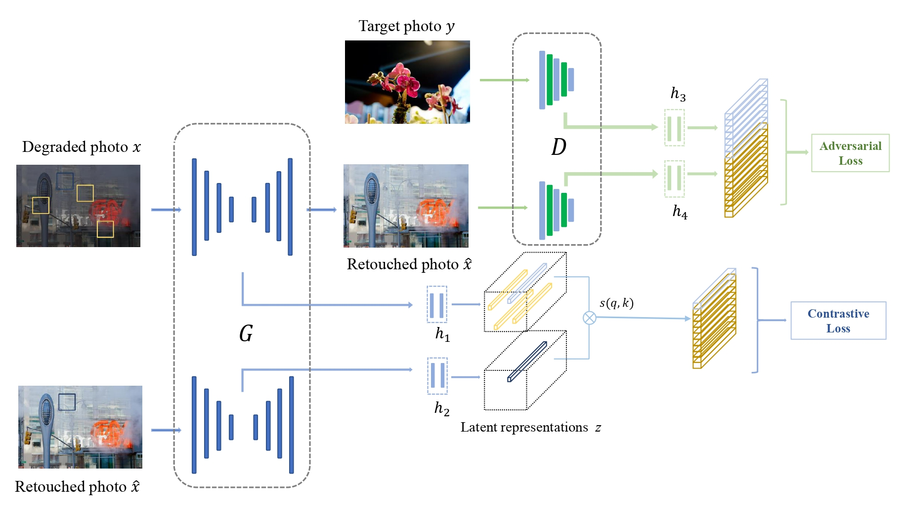

# Learning Deep Representations for Photo Retouching 
By [Di Li](https://scholar.google.com/citations?user=r6WfS2gAAAAJ), and [Susanto Rahardja](https://scholar.google.com/citations?user=OdkA4jMAAAAJ&hl=en) 

## Introduction

The codebase provides the official PyTorch implementation for the paper [" Learning Deep Representations for Photo Retouching"](https://ieeexplore.ieee.org/abstract/document/10227607) (accepted by IEEE Transactions on Multimedia).

<p align="center">
  
</p>

In this project, we present a a novel framework to retouch the degraded photos towards a specific photographic style in an unsupervised fashion. To be specific, we unify the design philosophy of the generator and the discriminator into a multi-scale form and reuse these powerful networks as feature extractors to obtain deep latent representations of the photos with varying scales. Then, we employed projection heads to map these deep representations to a neater loss space for evaluation. In particular, we utilized a contrastive scheme for generator to keep the content consistency and a cross entropy scheme for discriminator to improve the aesthetic quality. Powered by this simple yet efficient design philosophy, our algorithm surpasses previous algorithms on two well known datasets with photo enhancement task. As a learning framework compliable with various enhancement networks, our algorithm shows great potential to be a practical tool to efficiently and effectively build photo retouching systems with different needs.


## Citation
    If you find this repository useful, please kindly consider citing the following paper:

    ```
    @article{li2023learning,
    title={Learning Deep Representations for Photo Retouching},
    author={Li, Di and Rahardja, Susanto},
    journal={IEEE Transactions on Multimedia},
    year={2023},
    publisher={IEEE}
    }
    ```

## License

Our project is licensed under a [MIT License](LICENSE).